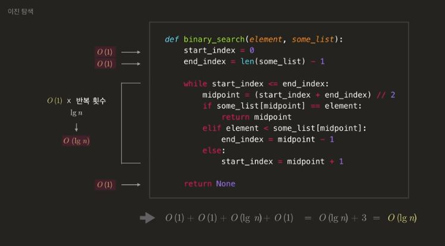
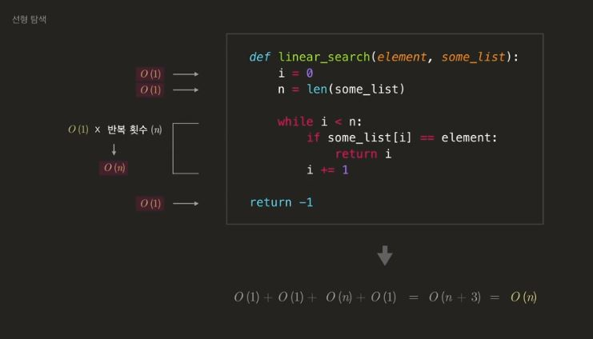

# 알고리즘 복잡도 (Algorithm Complexity)

## 1. 알고리즘의 평가

알고리즘을 평가하는데 있어서 **수행시간**과 **메모리 사용량**을 척도로 평가한다.  
  
수행시간에 해당하는 것이 시간 복잡도 (Time Complexity)  
메모리 사용량에 해당하는 것이 공간 복잡도 (Space Complexity) 이다.

둘다 중요하지만 더 중요한 것을 고르자면 시간복잡도가 더 중요하다.  
메모리는 기술 발전에 따라 늘릴 수 있지만, 시간은 돈으로도 살 수가 없다.  

최소한의 자원(시간, 공간)을 이용해 문제를 해결하는 알고리즘이 좋은 알고리즘이다.  

> 알고리즘은 일반적인 데스크탑 어플리케이션이나, 시간이 중요한 서비스( 지도 길찾기 서비스, 실시간 스트리밍 서비스 ..) 등에만 중요한 것이 아니라 Web 에도 중요하다. 브라우저가 사용할 수 있는 메모리는 일반적인 데스크탑 어플리케이션 보다 작은데, 이유는 웹 페이지에서 실행되는 자바스크립트가 시스템 메모리를 전부 사용해서 OS가 다운되는 것을 막기 위함이다. 즉, Web에서도 좋은 알고리즘을 사용해야 페이지의 성능을 올릴 수 있다.

## 시간복잡도 (Time Complexity)

시간복잡도란 알고리즘이 문제를 해결하기 위한 **시간(연산)의 횟수** 를 말한다.
시간복잡도를 측정할 때 시간을 직접 측정하기 보다는 **input 에 따른 연산의 횟수**로 측정하게 된다.  
하지만 연산의 횟수 또한 코드에 조건문과 반복분 등이 존재하면 상황에 따라 횟수가 모두 달라진다.
따라서 연산의 횟수를 카운팅 할때
1. 최선의 경우 (Best Case)
2. 최악의 경우 (Worst Case)
3. 평균의 경우 (Average Case)  

가 있는데, **최악의 경우**로 알고리즘의 시간복잡도를 평가한다.

### 연산 횟수는 어떻게 측정할까?

Program Step 에서 기본 단위(Elementary Operation)는
1. 대입연산
2. 산술연산(+, -, *, / ..)
3. 비교구문
4. 함수호출
   
정도로 나눌 수 있겠다.
Program Step 을 따라가면서 이 모든 기본단위들이 일어나는 수를 측정하면 된다. 기본적으로 단순 대입, 비교, 산술연산은 O(1) 이다.

예시로 선형 탐색과 이분 탐색의 시간복잡도를 계산해보자.

* 예시1) 선형탐색 시간복잡도 계산

* 예시2) 이분탐색 시간복잡도 계산

* 예시3)

## 점근적 표기법(Asymptotic notation)

## Reference
- [알고리즘과 시간 복잡도](https://feel5ny.github.io/2017/12/09/CS_01/)
- [[Algorithm] 알고리즘을 위한 시간복잡도 계산 방법 - Big-O 표기](https://seolhun.github.io/contents/algorithm-%EC%95%8C%EA%B3%A0%EB%A6%AC%EC%A6%98%EC%9D%84-%EC%9C%84%ED%95%9C-%EC%8B%9C%EA%B0%84%EB%B3%B5%EC%9E%A1%EB%8F%84-%EA%B3%84%EC%82%B0-%EB%B0%A9%EB%B2%95-big-o-%ED%91%9C%EA%B8%B0)
- [<Time Complexity : 시간복잡도> 구하는 법 + 코딩 팁](https://mimimimamimimo.tistory.com/2)